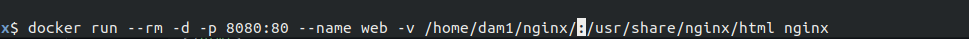
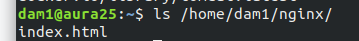
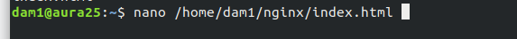
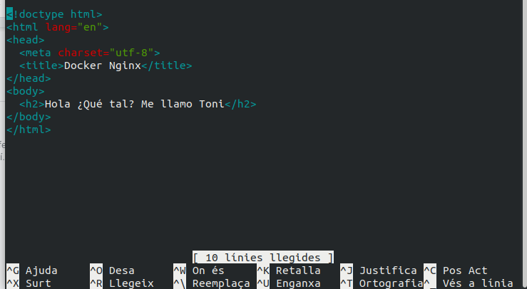
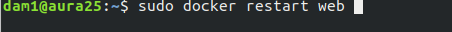
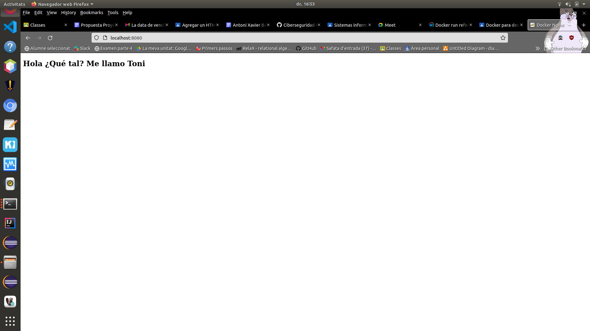

# DockerNginx

Para desplegar un contenedor en docker con html personalizado se inicia este comando que básicamente inicia un servidor de nginx en puerto 8080 le pone de nombre web y hace un volumen que enlaza el directorio del contenedor docker /usr/share/nginx/html y el directorio local /home/dam1/nginx (en mi caso).

En el directorio local tiene que haber el html personalizado con nombre de index.html.

Al iniciarlo se podrá ir a localhost:8080 y ver el resultado.

Se puede editar el archivo html y se verá reflejado en el servidor web

